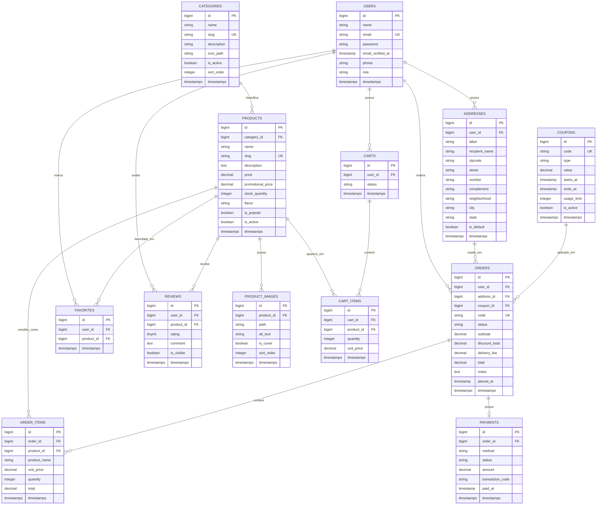

# DER - CupDogs

Este DER representa a estrutura planejada para o CupDogs, uma loja de cupcakes tematicos inspirada na referencia visual do Cupcats. A tela de referencia indica os principais modulos: catalogo, categorias, busca, carrinho, perfil e pedidos.

## Diagrama

## Entidades

| Entidade | Finalidade |
| --- | --- |
| `users` | Armazena clientes e administradores. Aproveita a base padrao de autenticacao do Laravel. |
| `addresses` | Enderecos de entrega vinculados a usuarios. |
| `categories` | Agrupa produtos por sabor ou linha visual, como morango, chocolate, menta e oreo. |
| `products` | Catalogo de cupcakes exibidos na vitrine, busca, categorias e cards populares. |
| `product_images` | Imagens dos cupcakes, incluindo capa e alternativas. |
| `carts` | Carrinho ativo ou convertido de cada usuario. |
| `cart_items` | Itens adicionados ao carrinho com preco congelado no momento da inclusao. |
| `orders` | Pedido fechado, com endereco, status, valores e observacoes. |
| `order_items` | Snapshot dos produtos comprados, preservando nome e preco historicos. |
| `payments` | Informacoes do pagamento do pedido. |
| `coupons` | Cupons promocionais opcionais para desconto. |
| `favorites` | Produtos salvos pelo usuario. |
| `reviews` | Avaliacoes dos produtos. |

## Regras de Relacionamento

- Um usuario pode ter varios enderecos, carrinhos, pedidos, favoritos e avaliacoes.
- Uma categoria pode classificar varios produtos.
- Um produto pertence a uma categoria principal.
- Um produto pode ter varias imagens.
- Um carrinho contem varios itens, e cada item aponta para um produto.
- Um pedido contem varios itens e pode ter um pagamento.
- Um pedido usa um endereco de entrega.
- Um cupom pode ser usado em varios pedidos, respeitando limite e validade.
- Favoritos devem ser unicos por par `user_id` e `product_id`.
- Avaliacoes devem ser unicas por par `user_id` e `product_id` quando a regra de negocio permitir apenas uma avaliacao por cliente.

## Status Sugeridos

### Carrinho

- `active`: carrinho em uso.
- `converted`: carrinho transformado em pedido.
- `abandoned`: carrinho abandonado.

### Pedido

- `pending`: pedido criado e aguardando pagamento.
- `paid`: pagamento confirmado.
- `preparing`: pedido em preparo.
- `out_for_delivery`: pedido saiu para entrega.
- `delivered`: pedido entregue.
- `canceled`: pedido cancelado.

### Pagamento

- `pending`: pagamento iniciado.
- `approved`: pagamento aprovado.
- `declined`: pagamento recusado.
- `refunded`: pagamento estornado.

## Indices e Restricoes

- `users.email` deve ser unico.
- `categories.slug` deve ser unico.
- `products.slug` deve ser unico.
- `orders.code` deve ser unico para rastreio amigavel.
- `coupons.code` deve ser unico.
- `favorites` deve ter indice unico composto por `user_id` e `product_id`.
- `reviews` pode ter indice unico composto por `user_id` e `product_id`.
- `cart_items` pode ter indice unico composto por `cart_id` e `product_id` para evitar itens duplicados.
